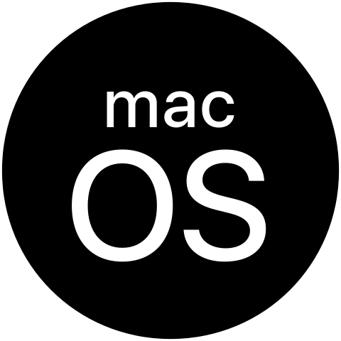

  

This organisation contains all of the relevant repositories for the [Revolt platform](https://revolt.chat).

# Links

- ### [🌍 Website](https://revolt.chat): The Revolt website.
- ### [💖 Donate to Revolt](https://insrt.uk/donate): Help support the project.
- ### [✨ awesome-revolt](https://github.com/insertish/awesome-revolt): Find libraries and more!
- ### [😎 Contributing to Revolt](https://github.com/revoltchat/revolt/discussions/282): Learn how to contribute to Revolt.
- ### [🦜 Discussions](https://github.com/orgs/revoltchat/discussions): Request features or ask questions.
- ### [🔧 Developer Documentation](https://developers.revolt.chat): Docs for developers.

# Download Links

Revolt is currently available on a variety of platforms:
- ### Any: [Web App / PWA](https://app.revolt.chat)
- ###  Windows 10 / 11: [Microsoft Store](http://go.microsoft.com/fwlink/?LinkId=532540&mstoken=246FT-4KJ4R-KYDQH-WC76C-FJPXZ)
- ###  Linux: [Arch User Repository](https://aur.archlinux.org/packages/revolt-desktop-git)
- ###  Linux: [FlatHub](https://flathub.org/apps/details/chat.revolt.RevoltDesktop)
- ###     Any Desktop: [revoltchat/desktop](https://github.com/revoltchat/desktop/releases)
- ###  Android: [Google Play Store](https://play.google.com/store/apps/details?id=chat.revolt.app.twa)
- ###  Android: [F-Droid Repo](https://fdroid.revolt.chat/repo)
